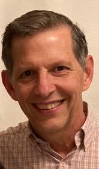

## [In English](https://www-rctx-org.translate.goog/convention/candidate-eduardo-ross.html?_x_tr_sch=http&_x_tr_sl=es&_x_tr_tl=en&_x_tr_hl=en&_x_tr_pto=wapp)

| {:width="200px"}  | Read this page [in english](https://www-rctx-org.translate.goog/convention/candidate-eduardo-ross.html?_x_tr_sch=http&_x_tr_sl=es&_x_tr_tl=en&_x_tr_hl=en&_x_tr_pto=wapp) |

Hola, soy Eduardo Ross, nací en México y a los tres meses de casado emigré a los Estados Unidos con mi esposa Abby. Conocí el Movimiento en San Antonio y me incorporé (así se decía en ese entonces) en 1998.

## Apostolado
Mis cinco hijos estudiaron en Rolling Hills Academy donde empecé a trabajar en diversos apostolados.  Estuve muy involucrado en Rolling Hills como ‘maestro de computación’ y en el consejo de apoyo al director. Cuando mis hijos eran más chicos, estuvimos activos en Conquest.  También me ha tacado participar en misiones desde que iniciaron en San Antonio hace más de 20 años.

He sido encargado de algún equipo de señores, me ha tocado organizar varios retiros y algún congreso de señores hace ya muchos años. 

Me tocó también ayudar a armar la organización ‘non-profit’ en San Antonio y actualmente soy el tesorero.

En los últimos 5 años he sido el director de la Localidad.

## Representación
Regnum Christi ha sido una parte integral de nuestra familia y tengo una perspectiva amplia sobre el Movimiento en San Antonio que puedo hacer llegar a la Convención del Territorio.  La convención será con mira al futuro, pero quizá mi experiencia del pasado sirva para colorear la visión hacia lo que nos esta llamando el Señor ha hacer para extender Su Reino.

